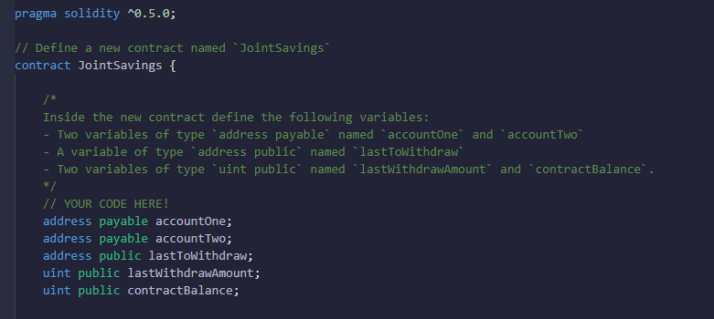
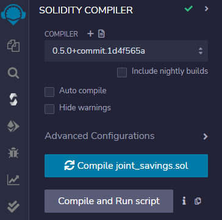
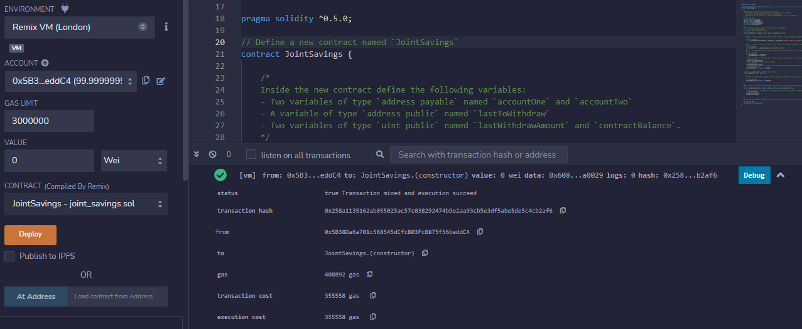
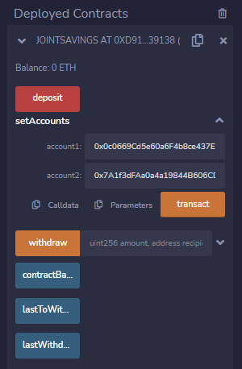
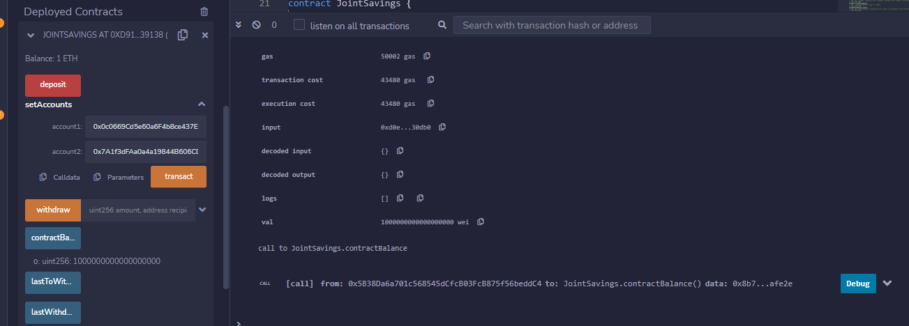
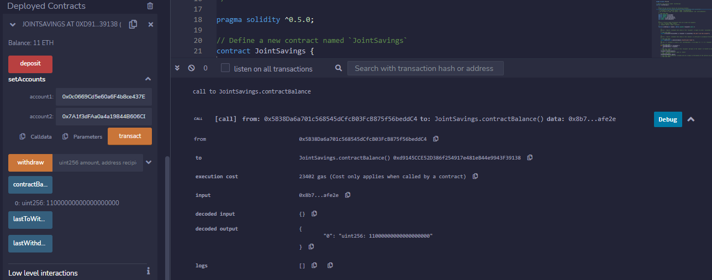
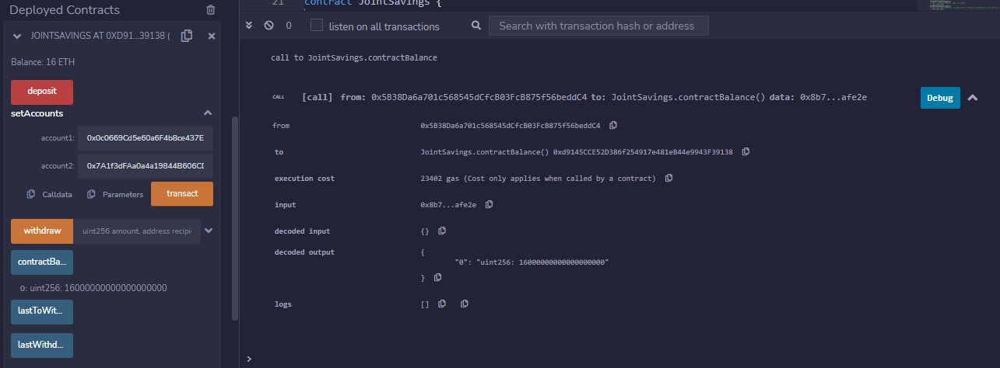
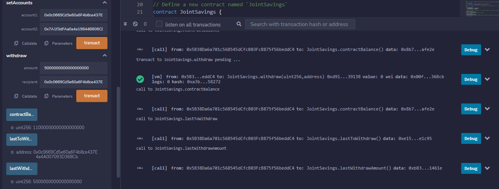
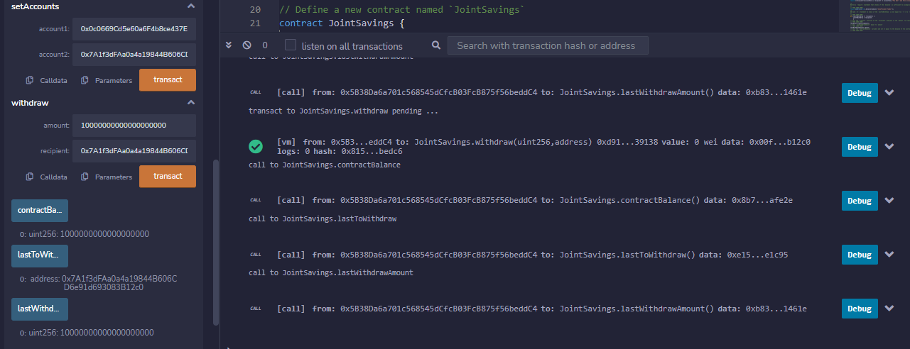

# Joint_Savings_Smart_Contract

___
During this week's challenge, I help a FinTech Startup build smart contracts to automate many of the its financial processes and features, such as hosting joint savings accounts.

To automate the creation of joint savings accounts, I will first create a Solidity smart contract that accepts two user addresses. These addresses will be able to control a joint savings account. The smart contract will use ether management functions to implement the startup's requirements for providing the features of the joint savings account. These features will consist of the ability to deposit and withdraw funds from the account.
___

## Technologies

This project leverages Solidity and the RemixIDE:

* [RemixIDE](https://remix-project.org/) - a powerful toolset for developing, deploying, debugging, and testing Ethereum and EVM-compatible smart contracts.
___

## Usage

In order to run this program, one should use the following link for the RemixIDE https://remix.ethereum.org/ and then compile and deploy the smart contract joint_savings.sol.

Further, as one interacts with the smart contract, it may be helpful to utilize the following Ethereum Unit Converter - https://eth-converter.com/.
___

## Execution_Results

1) First I opened the solidity file and created the smart contract - joint_savings.sol

2) Once I was comfortable with the code, I compiled and then deployed the contract

3) I then interacted with the smart contract by using various functions "setAccounts", "deposit", "withdraw", "contractbalance", lastToWthdraw", and "lastWithdrawAmount"

* "setAccounts"

* Transaction 1 - "Deposit 1 Ether as Wei"

* Transaction 2 - "Deposit 10 Ether as Wei"

* Transaction 3 - "Deposit 5 Ether"

* Transaction 4 - "Withdraw 5 Ether into "accountOne"

* Transaction 5 - "Withdraw 10 Ether into "accountTwo"

___

## Contributors

Franco Thomas - francothomas1989@gmail.com

___

## License

MIT License